# Instructions for running the 2024-mmWaveRadarSensors project

This page contains the guide for running the human pose recognition model on TI IWRL6432.

## Download the zip file for the 2024-mmWaveRadarSensors project

[-> Download link](https://github.com/spe-uob/2024-mmWaveRadarSensors/archive/refs/heads/dev.zip)

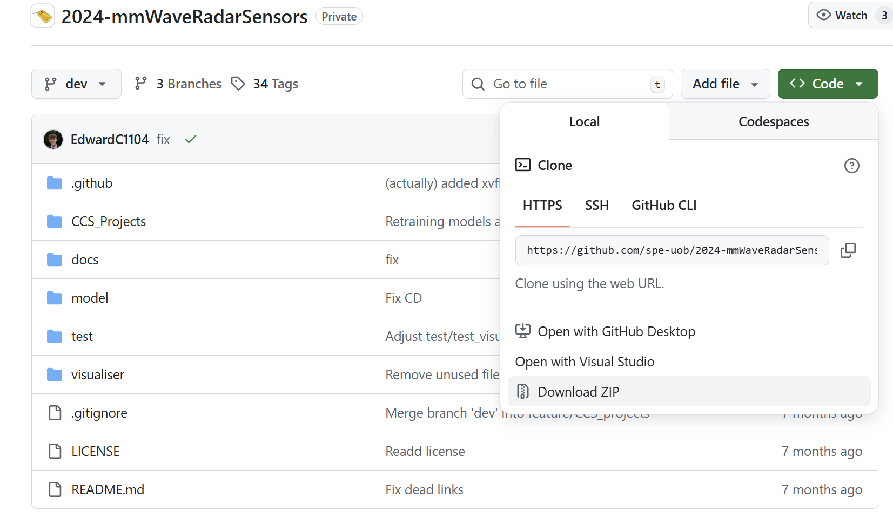

## Install MMWAVE-L-SDK 05.04

:::important
MMWAVE-L-SDK 05.04 is **not** the latest version, it is an old version released in 2024. Please install this along with the latest version. You wouldn't be able to build last year's project with the new SDK.
:::

[-> Installation Link](https://www.ti.com/tool/download/MMWAVE-L-SDK/05.04.00.01)

Make sure the MMWAVE-L-SDK 05.04 is present in the `C:\ti` folder

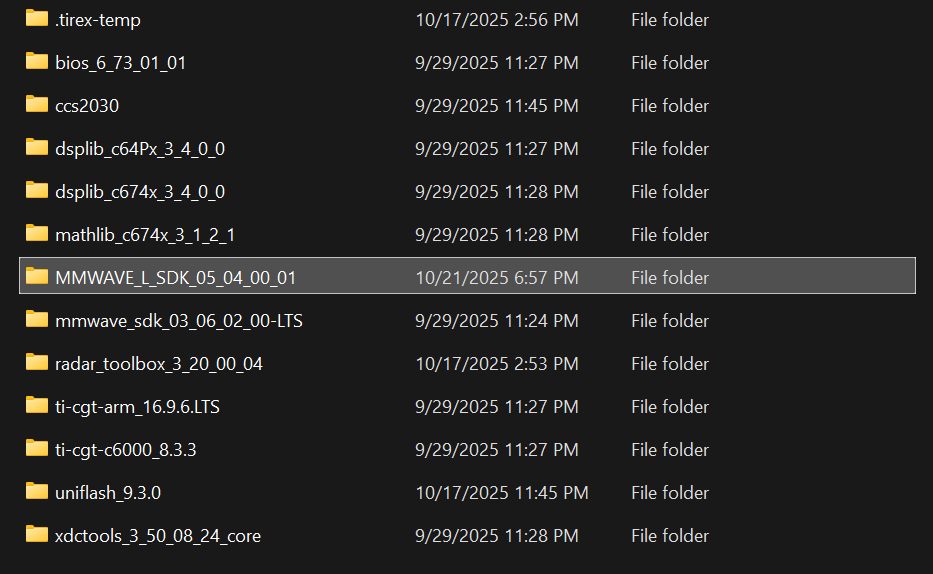


## Update CCS Settings

1. Navigate to `File -> Preferences -> Code Composer Studio Settings` 
    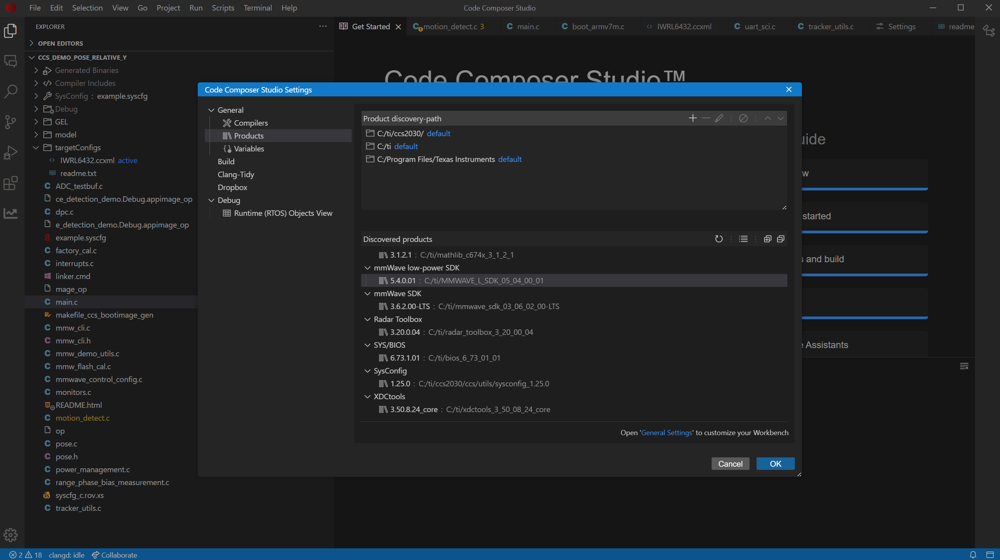
2. Refresh the *Discovered Products*
    
3. Make sure the MMWAVE-L-SDK 05.04 is the only entry showing up for mmWave low-power SDK
    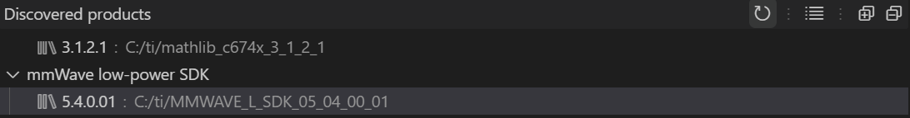

:::tip
Move the newer version of the MMWAVE-L-SDK out of the `C:\ti` directory temporarily if multiple versions are detected to ensure the project is compiled with version 05.04.
:::

## Build the project

1. Open the `ccs_demo_POSE_RELATIVE_Y` folder in CCS
    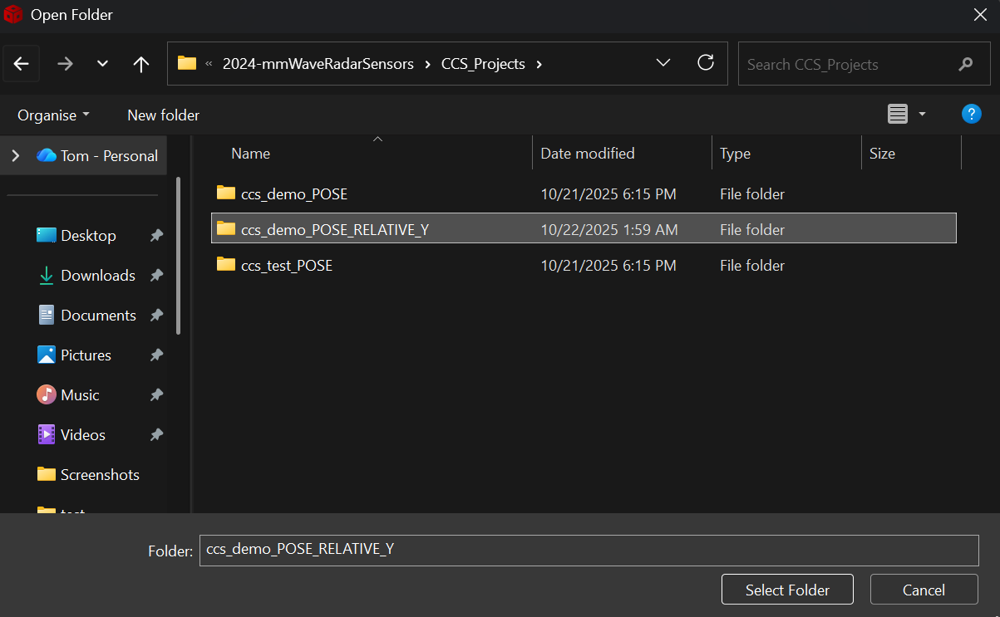
2. Press *Clean projects* then *Build projects*
    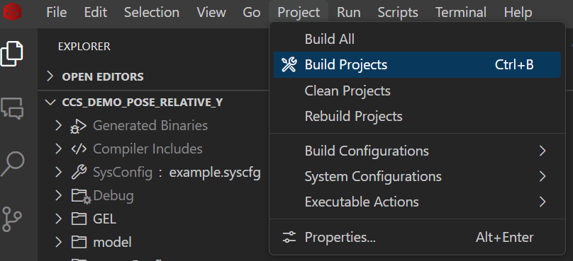

## Run the build    

:::tip
**Make sure you have plugged in the board on your laptop and test the connection**
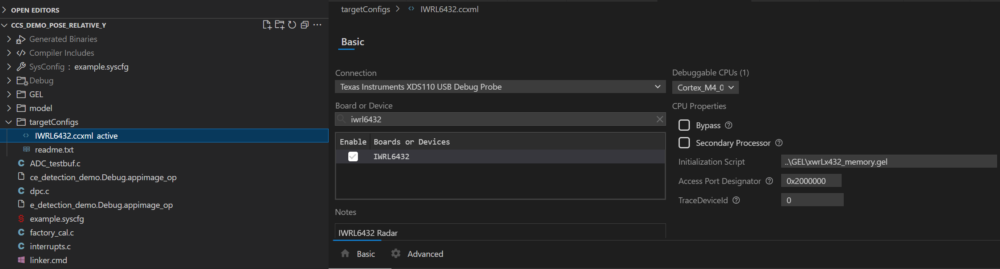
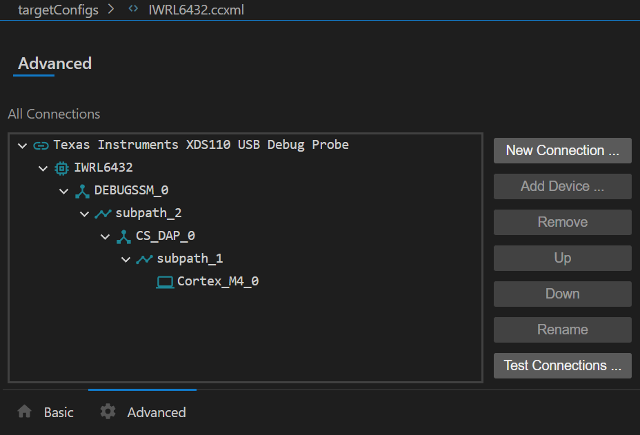
:::

1. Press `Start Debugging`
    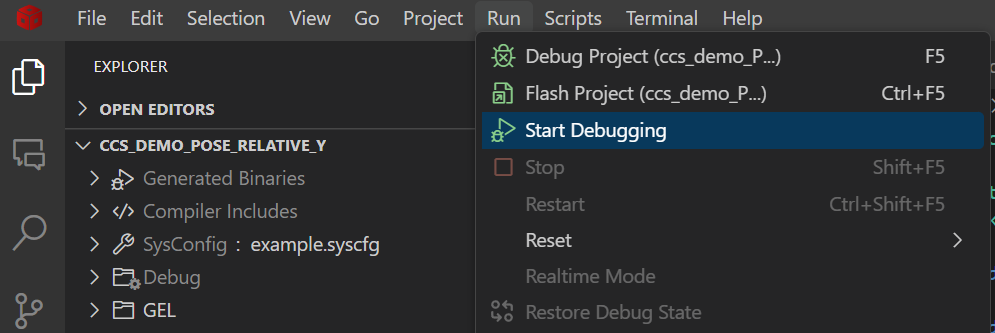
2. Navigate to the Debug tab on the left sidebar and press `Continue`
    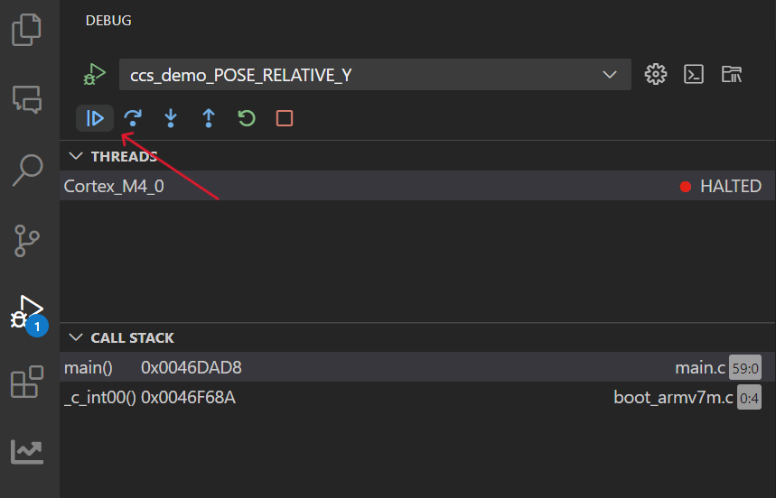
3. Observe the terminal output, the program should be running properly when you see the following CIO output
    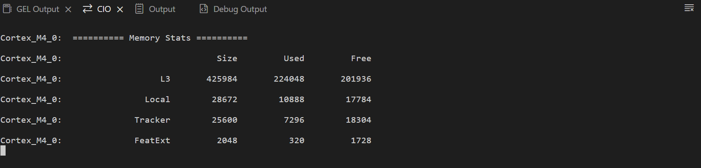

**If it does not work, press the small button on the board to reset and try again**

## Launch the visualizer

1. Navigate to `/path/to/2024-mmWaveRadarSensors/visualiser` (replace /path/to/... with the link of the visualizer folder)
2. Run the following command in the terminal 
    ```bash
    python main.py
    ```
3. Select the correct UART port, you can find it from device manager (in this example my webcam is blocked but it shouldn't affect the result anyways)
    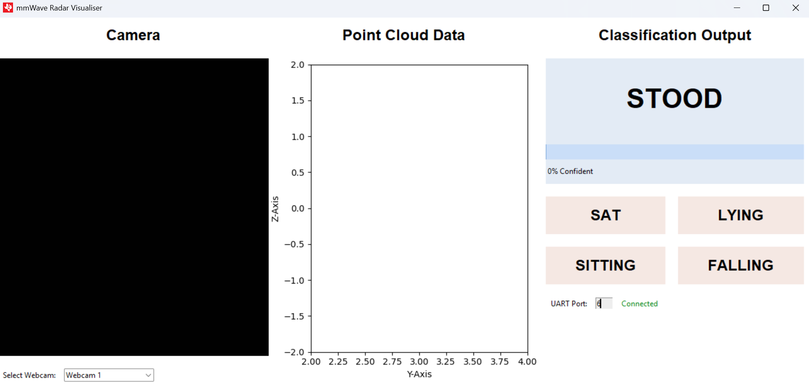
    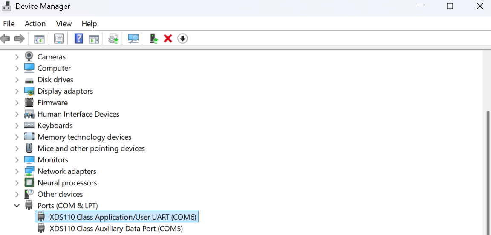
    