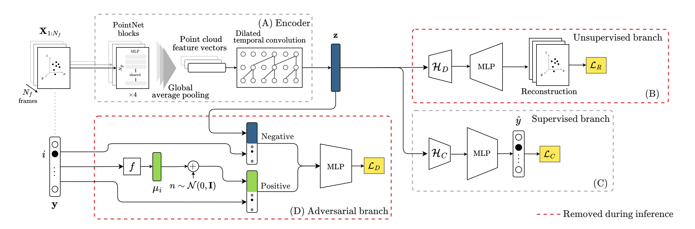

# Open-Set Gait Recognition from Sparse mmWave Radar Point Clouds

This work tackles the Open-Set Gait Recognition problem using sparse mmWave radar point clouds, the system must classify known individuals and detect unknown ones. The data is noisy and sparse, unlike dense micro-Doppler spectrograms used in most past work. It solves the realistic open-set human identification problem through a multi-branch adversarial autoencoder (PCAA) that fuses classification, reconstruction, and probabilistic detection. It demonstrates the ability to handle unseen subjects while running on edge-friendly radar data.

:::info

[**Paper Link**](https://www.researchgate.net/publication/389747700_Open-Set_Gait_Recognition_from_Sparse_mmWave_Radar_Point_Clouds) | 
[**Github**](https://github.com/rmazzier/OpenSetGaitRecognition_PCAA) |
[**Dataset**](https://zenodo.org/records/14974386)

:::

## Key Challenges

### 1. Sparse & Noisy Input
    - Radar point clouds contain few reflection points per frame (≈150–200), making it difficult to model gait motion compared to dense µD (micro-Doppler) images.

### 2. Open-set Recognition
    - The system must not only recognize known gaits but also detect unseen subjects which is a much harder generalization task.

### 3. Edge Deployment Constraints
    - Targeting edge computing scenarios, requiring compact and computationally efficient architectures.

---

## Novel Dataset: *mmGait10* 

To evaluate the method, they introduce *mmGait10*, a public dataset:

**10 subjects, ≈5 hours of data, captured via TI MMWCAS-RF-EVM (77–81 GHz) radar.**

Each person recorded under 3 walking conditions:
    1. Free walking

    2. Walking with smartphone

    3. Hands in pockets

200 points/frame, 10 Hz, indoor 7.8 × 7.3 m environment.

---

## Proposed Solution: PCAA (Point Cloud Adversarial Autoencoder)

The authors propose a **dual-branch neural network** architecture called **PCAA**, combining **supervised** and **unsupervised** learning for robust feature extraction.

**The model consists of a bunch of PointNet blocks and temporal dilated convolutions, I am not sure if it will run on a Cortex M4 CPU.**

---

## Experiments and Results

* Compared **PCAA** against **OR-CED** (previous µD-based open-set model adapted for point clouds), achieved **~24% average F1-score improvement** over OR-CED.
* Tested across **multiple openness levels** (2.99–39.7%), the model performs robustly even when openness (unknown subjects ratio) is high.

