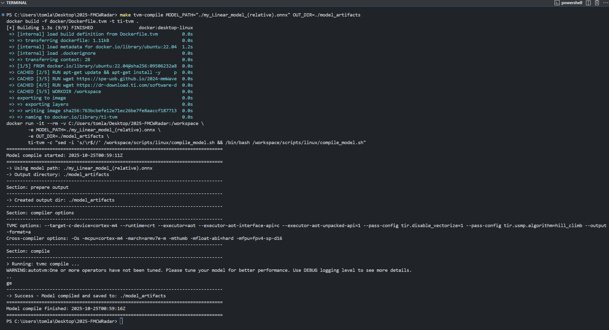
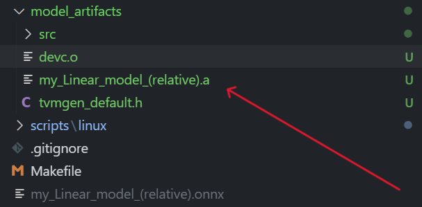

# Model Compilation 

Once you have exported your trained PyTorch model to a onnx file, you will need to compile the model into C binaries in order to run on the board as a CCS project. 

## Option 1: Use our TI-TVM Docker container

- Launch the container and run custom commands

    ```bash
    make tvm 
    ```
- Shortcut for launching the container and run compilation

    ```bash
    make tvm-compile MODEL_PATH=./your_model_name.onnx OUT_DIR=./model_artifacts
    ```

Example terminal output



Output files



## Option 2: Setup your own environment

The [2024-mmWaveRadarSensors](https://github.com/spe-uob/2024-mmWaveRadarSensors) team has written a detailed guide on model compilation, you can follow the instructions step by step to achieve the same result.

[*-> Model Compilation Guide*](https://spe-uob.github.io/2024-mmWaveRadarSensors/General/User_Instructions.html#compiling-the-model)